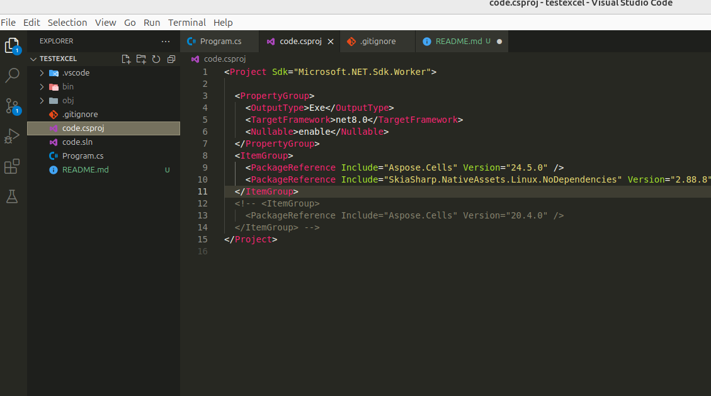

Project test library aspose.cells run on non-WindowOS devices.

if using version 20.4.0 it will throw new exception on this platform not support

=> using version 24.5.0 aspose.cells using SkiaSharp instead of System Drawing Common
this follow microsoft solution
